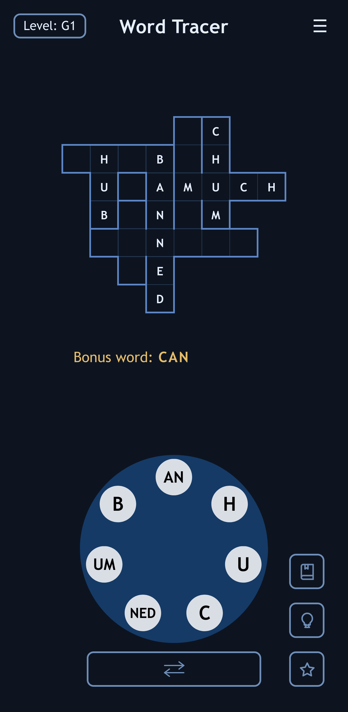

# Word Tracer

Word Tracer is a word puzzle game with crossword-style boards and a swipeable letter wheel. Trace words from the wheel to reveal the grid, clear each level, and keep an eye out for bonus words.

Fully offline and ad-free.

## Start Playing

Play online: https://plhosk.github.io/wordtracer/



## Play Locally

Clone the Git repository to play locally (requires Git and Node.js v20 or newer):

```bash
git clone https://github.com/plhosk/wordtracer.git
cd wordtracer
npm install
npm run dev
```

Then open the local Vite URL shown in your terminal. Default: `http://localhost:5173`

## How To Play

- Swipe across the wheel to build a word from the available tokens.
- Correct answers reveal words on the board.
- Use the swap button below the wheel to reverse multi-letter tokens when a word needs the other direction.
- Need a hint? Try the hint button.
- Guess all the words correctly to finish the level and unlock the next one.
- Comes with 2,484 levels of increasing difficulty.

## Features

- Look up swiped words in the built-in dictionary
- Hint system shows a partial dictionary entry
- Multiple level packs with saved progress
- Light and dark themes
- Web and Android support using Vite and Capacitor

## API

An optional Node server exposes the game through a REST API for tools, agents, and external clients.

```bash
npm run server:watch
```

The API runs on `http://localhost:3001` by default. Full endpoint documentation lives in `API.md`: https://github.com/plhosk/wordtracer/blob/main/API.md

See how many levels your local LLM agent can solve without help! Suggested AI prompt: `Read API.md. Solve levels starting with A1 using python httpx requests. The server is at http://localhost:3001. Make one API call at a time using uv run python -c.`

## Level Generation

Levels are pre-generated through a Python-based build pipeline that assembles lexicons, token combos, candidate boards, scoring, final pack export, and dictionary lookup data. A large set of generated levels are distributed with the game.

```bash
npm run levels:build
```

Pipeline notes live in `scripts/README.md`, and tuning guidance lives in `scripts/levels_build_tuning.md`.

## Development

Useful scripts:

```bash
npm run dev           # start the Vite web app
npm run check         # run TypeScript and ESLint
npm run build         # build the web app
npm run build:server  # build the Node API server
npm run server        # build and start the API server
npm run server:watch  # rebuild and restart the API server on changes
npm run preview       # preview the production web build locally
```

Android helpers:

```bash
npm run cap:sync      # build web assets and sync them into Capacitor
npm run android:build # build a debug APK
npm run android:open  # open the Android project in Android Studio
npm run android:run   # sync and run the app on Android
npm run android:release:preflight -- x.x.x  # require clean tree, matching versions, and exact release tag
npm run android:build:release:unsigned  # reproducible unsigned release APK build (npm ci + cap sync + gradle release)
npm run android:sign:release  # sign unsigned release APK with pinned apksigner (requires env vars)
npm run android:release:repro  # run preflight + unsigned build + signing
npm run release:set-version -- x.x.x  # bump app + F-Droid release versions
npm run fdroid:prepare-release -- x.x.x  # normalize metadata commit to git hash for this release
```

Reproducible Android release runbook: `docs/reproducible-builds.md`

## Licensing

Project and third-party notices for bundled data sources are documented in `THIRD_PARTY_NOTICES.md`.
